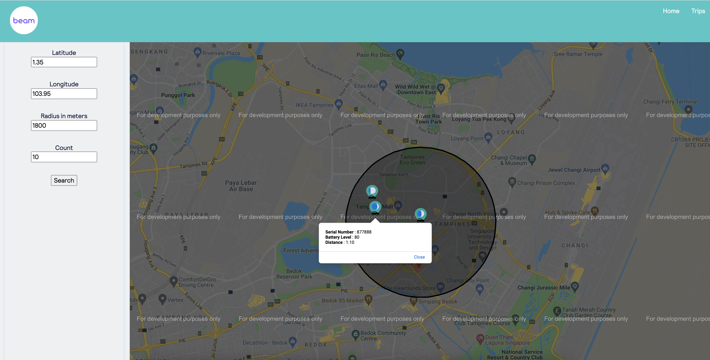

# ride 

Coding test

## Installing

- Install [Node.js](https://nodejs.org/en/) (node v.12.16.x, >npm 6.12.x) which is used as web server to serve the Javascript, HTML and CSS files for development and testing.
- Install MYSQL DB Instance - 5.7. Create database - ride - Execute the scripts under sqlscripts folder
- Configure the db credentials under app/config/database.js

## Running Application

- Run 'npm install' after unzipping the code.
- Run 'npm run start' to execute the application.
- API will be available on PORT 5000
- CLIENT will be available on PORT 3000
- Navigate to http://localhost:3000 on browser to launch
